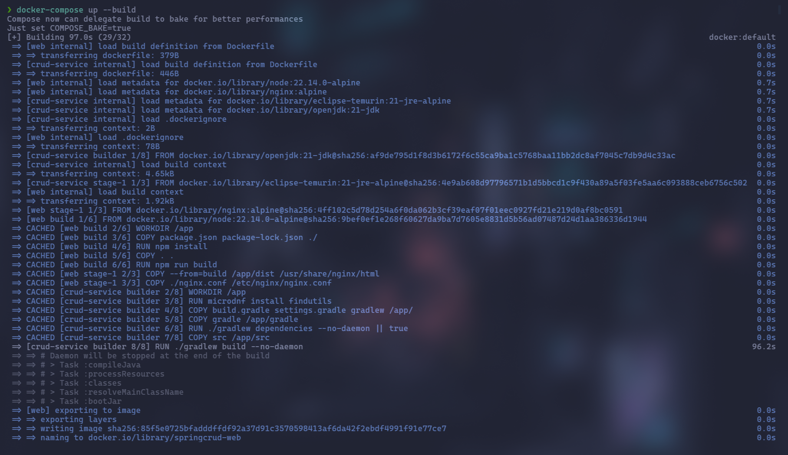
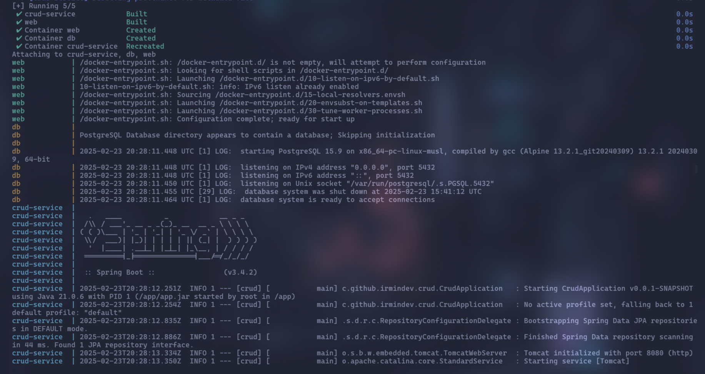
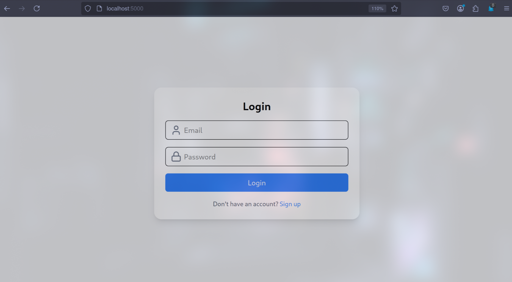
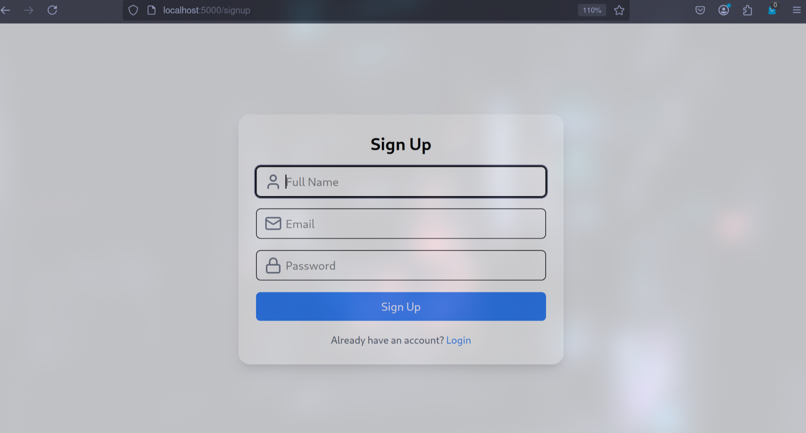
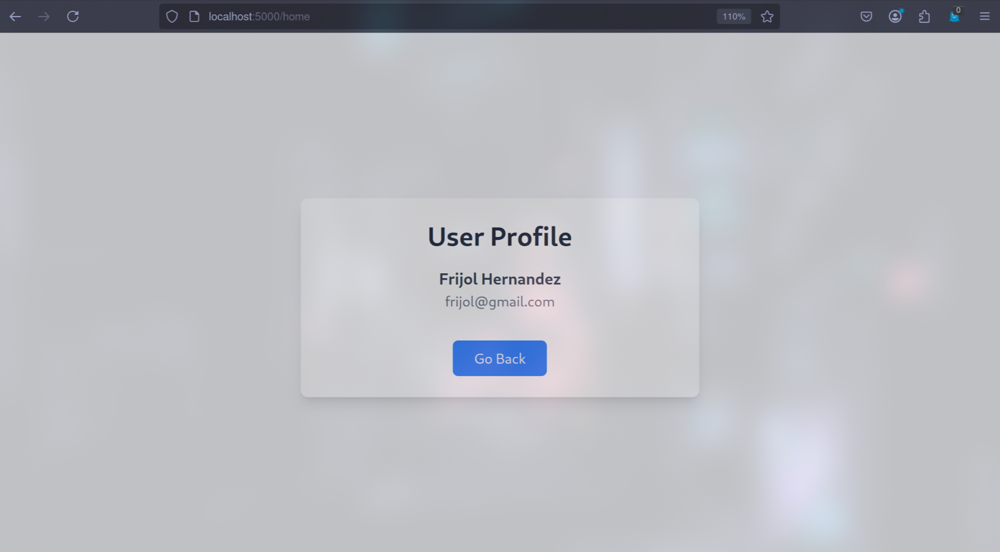
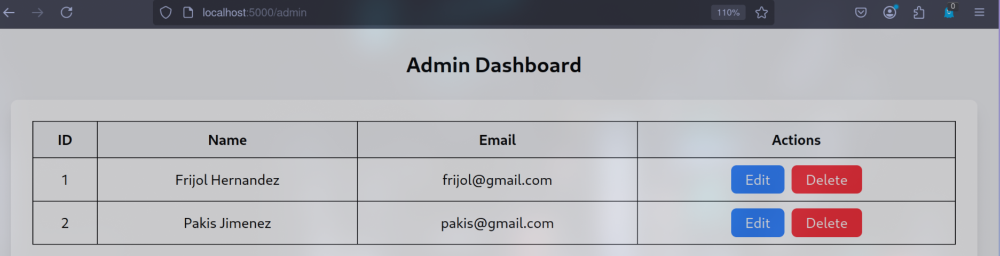
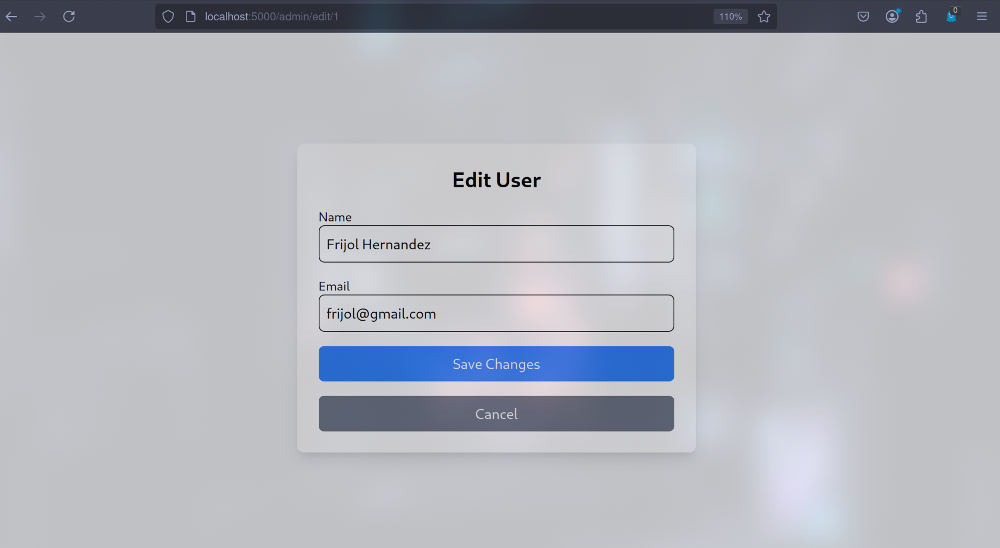
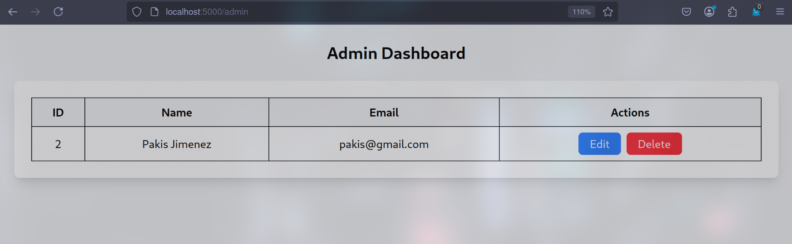

# Homework 3

In this homework you can find two projects, the backend and the frontend, each one has their own purpose.

## CRUD Backend

In the crud-backend you have a spring boot project, this project is a web API Rest for a single user entity. Let's take a look on the endpoints.

**URL**: `/api/user/{id}`
**Method**: `GET`
**Parameters**:
> | name      |  type     | data type               | description                                                           |
> |-----------|-----------|-------------------------|-----------------------------------------------------------------------|
> | id      |  required | String   | Is the ID needed to do the query, this ID must be on the URL.  |
> | token      |  required | String   | The token is the JWT generated in each session, it must to be in the Authorization headers using Bearer.  |

**Responses**:

> | http code     | content-type                      | response                                                            |
> |---------------|-----------------------------------|---------------------------------------------------------------------|
> | `400`         | `application/json`    | `{"message":"Invalid token"}` |      
> | `403`         | `application/json`    | `{"message":"Token expired"`  |
> | `401`         | `application/json`    | `{"message":"The id in the token does not match the requested id or is not an ADMIN user"}`                            |
> | `200`         | `application/json`    | `{message: 'Success', user: {...}}`                      |

**Example response**:
```js
{
  message: 'Success',
  user: {
    id: 1,
    name: 'Frijolito Hernandez',
    email: 'Frijolito@gmail.com',
    role: 'USER'
  },
}
```
---
**URL**: `/api/user/register`
**Method**: `POST`
**Parameters**:
> | name      |  type     | data type               | description                                                           |
> |-----------|-----------|-------------------------|-----------------------------------------------------------------------|
> | name      |  required | String   | The name is the name of the user yo want to register.  |
> | email      |  required | String   | The email is part of the credentials needed to login.  |
> | password      |  required | String   | The password is the key you want to use for your account.  |


**Responses**:

> | http code     | content-type                      | response                                                            |
> |---------------|-----------------------------------|---------------------------------------------------------------------|
> | `400`         | `application/json`    | `{"message":"Email already used"}` |
> | `200`         | `application/json`    | `{message: 'Success', user: {...}, token: '...'}`                      |
**Example request**:
```js
{
  name: 'Frijolito Hernandez',
  email: 'Frijolito@gmail.com',
  password: '12345678'
}
```

**Example response**:
```js
{
  message: 'Success',
  user: {
    id: 1,
    name: 'Frijolito Hernandez',
    email: 'Frijolito@gmail.com',
    role: 'USER'
  },
  token: '...'
}
```
---
**URL**: `/api/user/login`
**Method**: `POST`
**Parameters**:
> | name      |  type     | data type               | description                                                           |
> |-----------|-----------|-------------------------|-----------------------------------------------------------------------|
> | email      |  required | String   | The email is part of the credentials needed to login.  |
> | password      |  required | String   | The password is the key you want to use for your account.  |


**Responses**:

> | http code     | content-type                      | response                                                            |
> |---------------|-----------------------------------|---------------------------------------------------------------------|
> | `400`         | `application/json`    | `{"message":"Incorrect credentials"}` |
> | `200`         | `application/json`    | `{message: 'Success', user: {...}, token: '...'}`                      |
**Example request**:
```js
{
  email: 'Frijolito@gmail.com',
  password: '12345678'
}
```

**Example response**:
```js
{
  message: 'Success',
  user: {
    id: 1,
    name: 'Frijolito Hernandez',
    email: 'Frijolito@gmail.com',
    role: 'USER'
  },
  token: '...'
}
```
---
**URL**: `/api/user/all`
**Method**: `POST`
**Parameters**:
> | name      |  type     | data type               | description                                                           |
> |-----------|-----------|-------------------------|-----------------------------------------------------------------------|
> | token      |  required | String   | The token is the JWT generated in each session, it must to be in the Authorization headers using Bearer and the user must to be ADMIN.  |

**Responses**:

> | http code     | content-type                      | response                                                            |
> |---------------|-----------------------------------|---------------------------------------------------------------------|
> | `400`         | `application/json`    | `{"message":"Invalid token"}` |
> | `400`         | `application/json`    | `{"message":"Unauthorized"}` |
> | `200`         | `application/json`    | `{message: 'Success', user: [...]}`|


**Example response**:
```js
{
  message: 'Success',
  users: [
    {
      id: 1,
      name: 'Frijolito Hernandez',
      email: 'Frijolito@gmail.com',
      role: 'USER'
    },
    {
      id: 2,
      name: 'Pakis Jimenez',
      email: 'pakis@gmail.com',
      role: 'ADMIN'
    }
  ]
}
```
---

**URL**: `/api/user/{id}`
**Method**: `DELETE`
**Parameters**:
> | name      |  type     | data type               | description                                                           |
> |-----------|-----------|-------------------------|-----------------------------------------------------------------------|
> | id      |  required | String   | Is the ID needed to do the query, this ID must be on the URL.  |
> | token      |  required | String   | The token is the JWT generated in each session, it must to be in the Authorization headers using Bearer.  |

**Responses**:

> | http code     | content-type                      | response                                                            |
> |---------------|-----------------------------------|---------------------------------------------------------------------|
> | `400`         | `application/json`    | `{"message":"Invalid token"}` |      
> | `401`         | `application/json`    | `{"message":"The id in the token does not match the requested id or is not an ADMIN user"}`                            |
> | `403`         | `application/json`    | `{"message":"Token expired"`  |
> | `409`         | `application/json`    | `{"message":"Email already used"`  |
> | `410`         | `application/json`    | `{"message":"Entity not found"`  |
> | `200`         | `application/json`    | `{message: 'Success', user: {...}}`                      |

**Example response**:
```js
{
  message: 'Success',
}
```
---
**URL**: `/api/user/{id}`
**Method**: `PUT`
**Parameters**:
> | name      |  type     | data type               | description                                                           |
> |-----------|-----------|-------------------------|-----------------------------------------------------------------------|
> | name      |  required | String   | The name is the new name of the user yo want to update.  |
> | email      |  required | String   | The email is the new email that you want to update.  |
> | id      |  required | String   | Is the ID needed to do the query, this ID must be on the URL.  |
> | token      |  required | String   | The token is the JWT generated in each session, it must to be in the Authorization headers using Bearer.  |


**Responses**:

> | http code     | content-type                      | response                                                            |
> |---------------|-----------------------------------|---------------------------------------------------------------------|
> | `400`         | `application/json`    | `{"message":"Invalid token"}` |      
> | `401`         | `application/json`    | `{"message":"The id in the token does not match the requested id or is not an ADMIN user"}`                            |
> | `403`         | `application/json`    | `{"message":"Token expired"`  |
> | `409`         | `application/json`    | `{"message":"Email already used"`  |
> | `410`         | `application/json`    | `{"message":"Entity not found"`  |
> | `200`         | `application/json`    | `{message: 'Success', user: {...}}`                      |
**Example request**:
```js
{
  name: 'Frijolito Hernandez',
  email: 'Frijolito@gmail.com',
}
```

**Example response**:
```js
{
  message: 'Success',
  user: {
    id: 1,
    name: 'Frijolito Hernandez',
    email: 'Frijolito@gmail.com',
    role: 'USER'
  }
}
```

## Installation

To set up the backend and frontend, you only need to execute the following command:

```sh
  docker-compose up --build
```

This command will build both images, the frontend and the backend and then, create both containers with the necessary configuration.

You need to have the following utilities (depending your OS):
  * docker
  * docker-compose
  * docker-buildx

You can access to the app using the port `5000` on your localhost, and using the port `8080` to connect to the REST API.

If you want to create an `ADMIN` user manually, you need to run the following commands:

```sh


```

## Explanation

For this homework, we create the following dockerfiles, one for the backend and one for the frontend:

```dockerfile
FROM openjdk:21-jdk AS builder

WORKDIR /app

RUN microdnf install findutils

COPY build.gradle settings.gradle gradlew /app/

COPY gradle /app/gradle

RUN ./gradlew dependencies --no-daemon || true

COPY src /app/src

RUN ./gradlew build --no-daemon

FROM eclipse-temurin:21-jre-alpine

WORKDIR /app

COPY --from=builder /app/build/libs/crud-0.0.1-SNAPSHOT.jar /app/app.jar

CMD ["java", "-jar", "app.jar"]
```

For this first dockerfile, we first create an environment with the needed dependencies to build the spring boot app into a jar file, and then, we move this jar file into a lighter image such as the eclipse-temurin that it's only the JRE running on alpine, a light linux distro.

```dockerfile
FROM node:22.14.0-alpine AS build

WORKDIR /app

COPY package.json package-lock.json ./

RUN npm install

COPY . .

ARG VITE_API_URL
ENV VITE_API_URL=$VITE_API_URL

RUN npm run build

FROM nginx:alpine

COPY --from=build /app/dist /usr/share/nginx/html

COPY ./nginx.conf /etc/nginx/nginx.conf

EXPOSE 80

CMD ["nginx", "-g", "daemon off;"]
```

In this second dockerfile, we build the app on the node image, to create the html, css and js files, and then, once the app is builded we move it in the nginx image, a great option to host web apps.

```yaml
services:
  db:
    image: postgres:15.9-alpine
    container_name: db
    ports:
      - "5432:5432"
    environment:
      POSTGRES_USER: "irmin"
      POSTGRES_PASSWORD: "irmin"
      POSTGRES_DB: "crud"
    volumes:
      - pgdata:/var/lib/postgresql/data
    
  crud-service:
    build:
      context: ./crud-backend
    container_name: crud-service
    ports:
      - "8080:8080"
    depends_on:
      - db
    environment:
      PORT: 8080
      DATABASE_URL: jdbc:postgresql://db:5432/crud
      DATABASE_USER: irmin
      DATABASE_PASSWORD: irmin
      JWT_SECRET: c2VjcmV0S2V5MTIzNDU2Nzg5MDEyMzQ1Njc4OTAxMjM0NTY3ODkwMTIzNA
      JWT_EXPIRATION: 86400000

  web:
    build:
      context: ./crud-frontend
      args:
        - VITE_API_URL=http://localhost:8080/api/user/
    container_name: web
    ports:
      - "5000:80"
    environment:
      NGINX_PORT: 80
volumes:
  pgdata:
```

Finally, we create a docker-compose file that declares all the needed data to build and create a correct environment for our containers, which are three, the backend, the db and the frontend. The docker-compose file is a yaml file, that is used to declare configuration, usually, we can do that with a single command, but instead of creating a huge command that is highly probably we would have a problem, we declare this info into a file. Also, it give us some extra tools for this kind of deployments.

When we run docker-compose up --build, we do the order of first build the images for the deployments that has this property, and then, create the containers.

## Proofs

In this section, I'll show you the screenshots of the app running.

### Docker compose up --build


### Logs of the containers


### Login Form


### Sign up Form


### User Profile


### Admin dashboard


### Edit User


### User deleted
